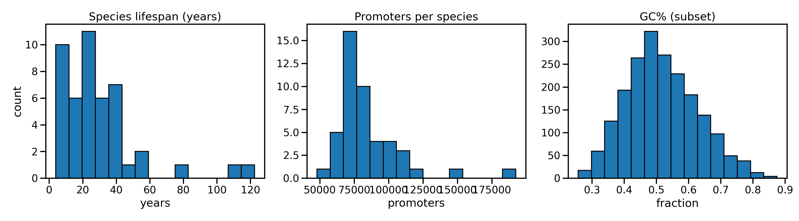
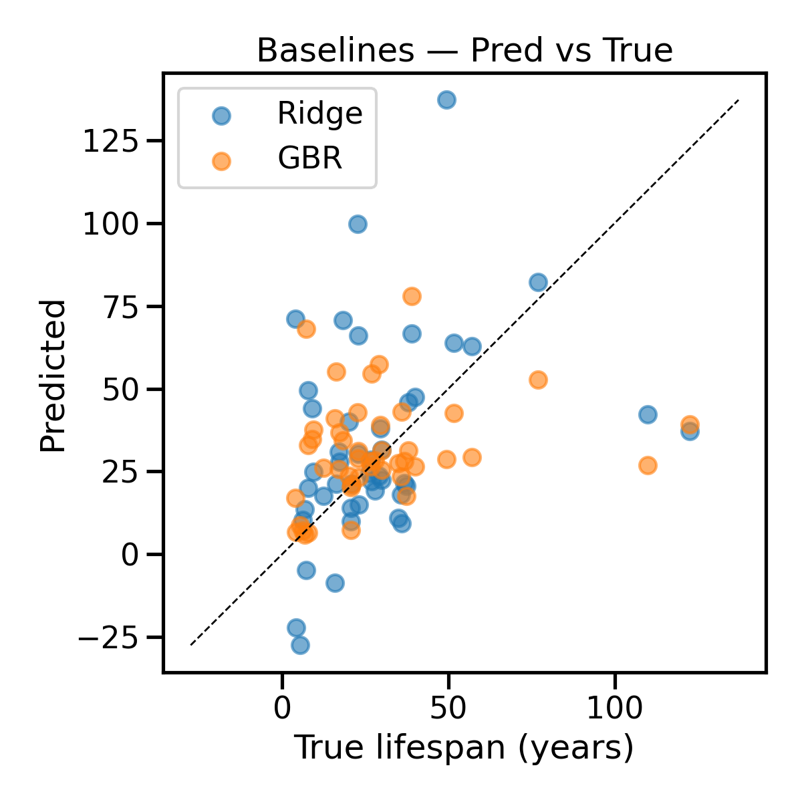
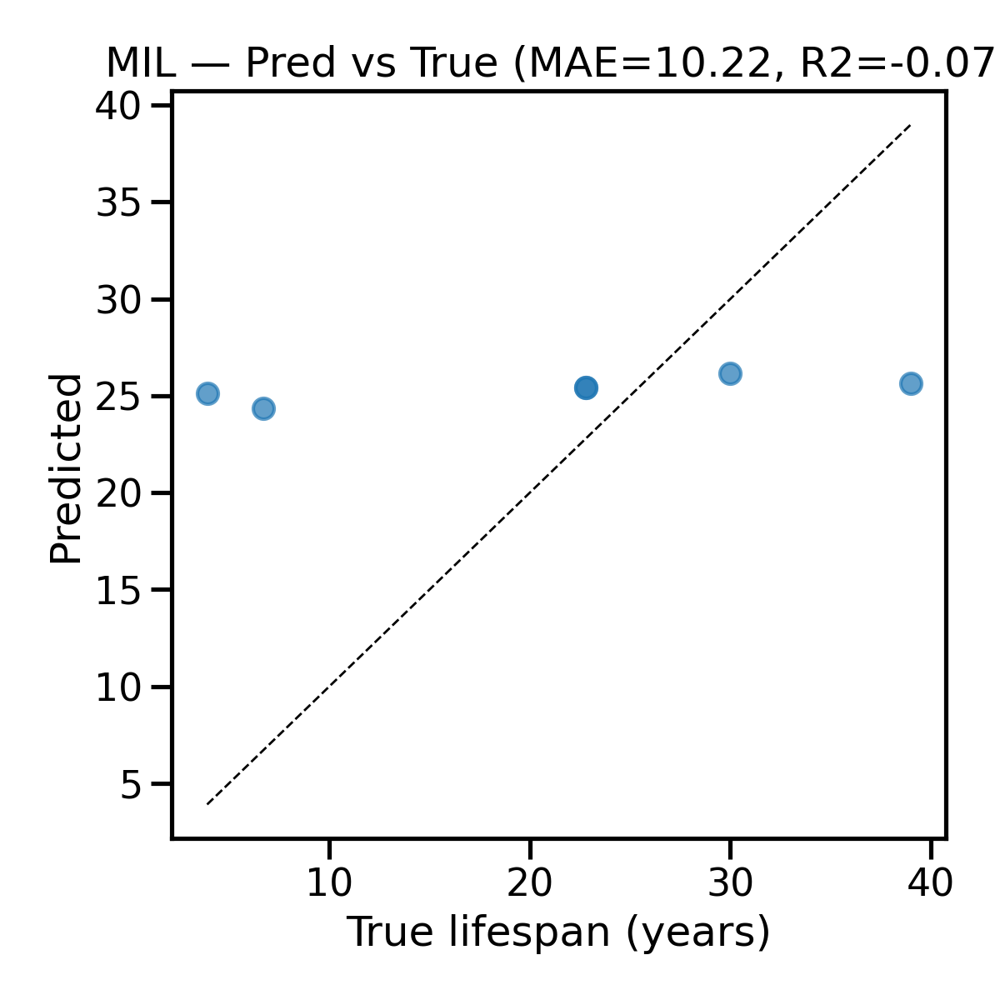
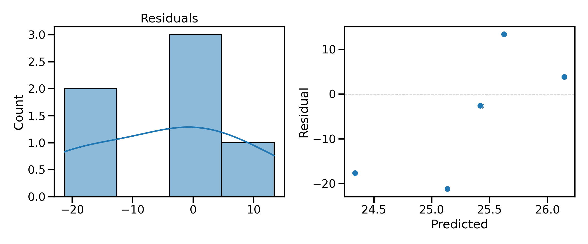

# Discovering Genomic Signatures of Mammalian Longevity (Promoter-Only)

**Master’s Dissertation Repository — Sohaib Abbas**  
Supervised by **Prof. Dr. Mark C. Harrison**  
Approval: **08 Jul 2025** · Ref: **P187615**

> *An end-to-end, reproducible pipeline to predict mammalian maximum lifespan using only 1-kb promoter DNA sequences per gene. The repository emphasizes transparent baselines, a compact deep Multiple-Instance Learning (MIL) model, and rigorous evaluation with uncertainty quantification.*

---

## Table of Contents
1. [Abstract](#abstract)
2. [Key Contributions](#key-contributions)
3. [Repository Layout](#repository-layout)
4. [Data & Ethics](#data--ethics)
5. [Environment & Installation](#environment--installation)
6. [Quickstart](#quickstart)
7. [Methodology](#methodology)
8. [Results](#results)
9. [Robustness & Interpretability](#robustness--interpretability)
10. [Reproducibility Checklist](#reproducibility-checklist)
11. [Limitations](#limitations)
12. [Future Work](#future-work)
13. [How to Cite](#how-to-cite)
14. [Acknowledgments](#acknowledgments)
15. [License](#license)

---

## Abstract
Mammalian promoter architecture integrates transcription factor motifs and chromatin context. Two sequence-level traits—GC content and CpG organization—are consistently linked to promoter function and methylation susceptibility. This project investigates whether promoter sequences alone contain sufficient signal to predict species-level maximum lifespan. We develop (i) biologically interpretable baseline models built from CpG/GC features and k-mer spectra and (ii) a compact deep MIL model to aggregate thousands of promoters into a single species-level prediction. Evaluation emphasizes group-aware cross-validation, bootstrap confidence intervals, and a pre-registered acceptance gate against a naive baseline.

**Data matrix:** 46 species × 258 features

---

## Key Contributions
- **Promoter-only prediction:** No enhancers or external covariates—tests the lower bound of sequence signal.
- **Transparent baselines:** Ridge and Gradient Boosting on GC, CpG O:E, and 4-mer spectra.
- **Deep MIL model:** CNN encoder + mean/attention pooling for species-level aggregation.
- **Evaluation discipline:** Group-aware CV (when taxonomy available), bootstrap CIs, and an explicit acceptance gate.
- **Reproducibility:** Single-script pipeline, fixed seeds, environment snapshot, run manifest, and plots/tables exported deterministically.

---

## Repository Layout
```

.
├── data/
│   ├── attn\_top\_promoters.csv         # Top attention-weighted promoters per test species
│   ├── baseline\_ablations.csv         # CpG/GC vs k-mer vs all-features ablation
│   ├── robustness\_bag\_size.csv        # Sensitivity of MIL to bag size
│   ├── data\_dictionary.json           # Schema of exported data artifacts
│   └── results\_summary.json           # Aggregated metrics & CIs
├── images/
│   ├── eda\_overview\.png               # Lifespan distribution, promoters/species, GC%
│   ├── baselines\_pred\_vs\_true.png     # Ridge/GBR predictions vs ground truth
│   ├── mil\_pred\_vs\_true.png           # MIL predictions vs ground truth
│   └── mil\_residuals.png              # Residual histogram + residuals vs fitted
├── src/
│   ├── code.py                        # End-to-end pipeline (features → baselines → MIL → exports)
│   ├── step1\_build\_shortlist.py       # Build species shortlist for downloads
│   ├── step2\_prepare\_downloads.py     # Create download manifest (NCBI)
│   └── step2\_fetch\_genomes.sh         # Fetch FASTA/GFF from NCBI
└── README.md

````

---

## Data & Ethics
- **Sources:** Reference genomes and GFF annotations obtained from **NCBI RefSeq** (mammalia).  
- **Privacy:** No human subject data or PII; the pipeline includes a **PII scan** safeguard for text inputs.  
- **Attribution & Licensing:** Respect data providers’ licenses/terms; do not redistribute raw genomes in this repo.  
- **Ethical framing:** The study avoids sensitive population inferences and focuses on cross-species comparative genomics.

---

## Environment & Installation
```bash
python -m venv .venv && source .venv/bin/activate   # (Windows: .venv\Scripts\activate)
pip install --upgrade pip
pip install pandas numpy scikit-learn torch xgboost rich tqdm biopython matplotlib seaborn
````

> The pipeline also writes an `artifacts/requirements.txt` snapshot during execution.

---

## Quickstart

### (A) Prepare genomes (optional; if you need to rebuild inputs)

```bash
python src/step1_build_shortlist.py
python src/step2_prepare_downloads.py
bash src/step2_fetch_genomes.sh
```

### (B) Run the full analysis

```bash
python src/code.py
```

Artifacts are exported to `data/` (tables) and `images/` (figures).

---

## Methodology

### Features

* **CpG observed/expected (O\:E)** and **GC%** per promoter.
* **k-mer spectra (k=4)** normalized by window length.
* Species-level matrices are computed by **averaging promoter features** per species.

### Baseline Models

* **Ridge Regression** (with standardization).
* **Gradient Boosted Regressor (GBR)**.
* **Cross-validation:** standard K-Fold or **GroupKFold** using taxonomy (family/order) when available.

### Deep MIL

* **Encoder:** 1D CNN → BatchNorm → GELU → AdaptiveAvgPool → Linear projection.
* **Pooling:** Mean pooling and **attention pooling**; final prediction is an even blend.
* **Loss/Opt:** Huber loss (δ=10), AdamW, patience-based early stopping.
* **Bags:** Up to `bag_size` promoters sampled per species per epoch.

### Metrics & Uncertainty

* **MAE**, **RMSE**, **R²**, **Spearman ρ**.
* **Bootstrap 95% CIs** for test metrics; acceptance gate compares against a naive baseline.

---

## Results

### Exploratory Data Analysis



### Baselines

| Model     | MAE   | RMSE  | R²    | Spearman ρ | n  | Grouped CV |
| --------- | ----- | ----- | ----- | ---------- | -- | ---------- |
| NaiveMean | 15.81 | 23.92 | 0.00  | 0.00       | 46 | No         |
| Ridge     | 21.36 | 29.95 | -1.78 | 0.29       | 46 | No         |
| GBR       | 16.83 | 24.62 | -0.45 | 0.24       | 46 | No         |

**Predicted vs True (Baselines)**


### Deep MIL (test split)

* **MAE:** 10.22  (95% CI \[4.825, 16.816])
* **RMSE:** 12.71  (95% CI \[6.181, 17.560])
* **R²:** -0.07    (95% CI \[-2.695, 0.096])
* **Spearman ρ:** 0.87 (95% CI \[0.000, 1.000])

**Predicted vs True (MIL)**


**Residual Diagnostics (MIL)**


---

## Robustness & Interpretability

* **Pooling ablation:** Mean vs attention pooling scores are exported in `data/results_summary.json`.
* **Bag-size sensitivity:** See `data/robustness_bag_size.csv` for MAE vs sampled promoters.
* **Attention inspection:** `data/attn_top_promoters.csv` lists the top-weighted promoters per species for interpretability.

---

## Reproducibility Checklist

* [x] Single-entry pipeline (`src/code.py`) with fixed random seeds.
* [x] Environment snapshot (`artifacts/requirements.txt`).
* [x] Deterministic exports (plots/tables with run manifest).
* [x] Clear data schemas (`data/data_dictionary.json`).
* [x] Group-aware CV supported when taxonomy is present.

---

## Limitations

* **Sample regime:** Relatively small number of species; promoter-only inputs likely under-represent distal regulatory influence.
* **Phylogeny:** While group-aware CV mitigates leakage, explicit **phylogenetic models** are not yet integrated.
* **Calibration:** Absolute lifespan calibration remains challenging; rank correlation is stronger than R².

---

## Future Work

* Integrate **enhancers** and cross-species **epigenomic marks**.
* Add **phylogenetic comparative methods** to control for shared ancestry.
* Explore **self-supervised pretraining** on genomic sequences.
* Expand species coverage and curate **taxonomy** for rigorous group splits.

---

## How to Cite

**APA**

> Abbas, S. (2025). *Discovering Genomic Signatures of Mammalian Longevity via Promoter-Sequence Machine Learning* (Master’s dissertation).

**BibTeX**

```bibtex
@thesis{Abbas2025LongevityPromoters,
  author    = {Sohaib Abbas},
  title     = {Discovering Genomic Signatures of Mammalian Longevity via Promoter-Sequence Machine Learning},
  school    = {Master's Dissertation},
  year      = {2025},
  note      = {Ref: P187615, Supervisor: Prof. Dr. Mark C. Harrison}
}
```

---

## Acknowledgments

I am grateful to **Prof. Dr. Mark C. Harrison** for his guidance and constructive feedback throughout this project. Thanks to the maintainers of **NCBI RefSeq** and the open-source community whose tools made this work possible.

---

## License

This work is released under the **MIT License**. See `LICENSE` for details.

